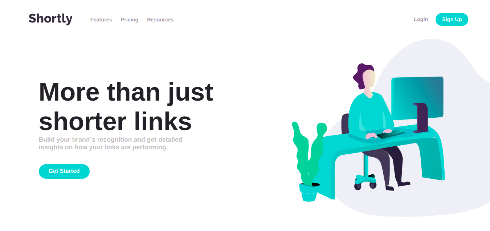
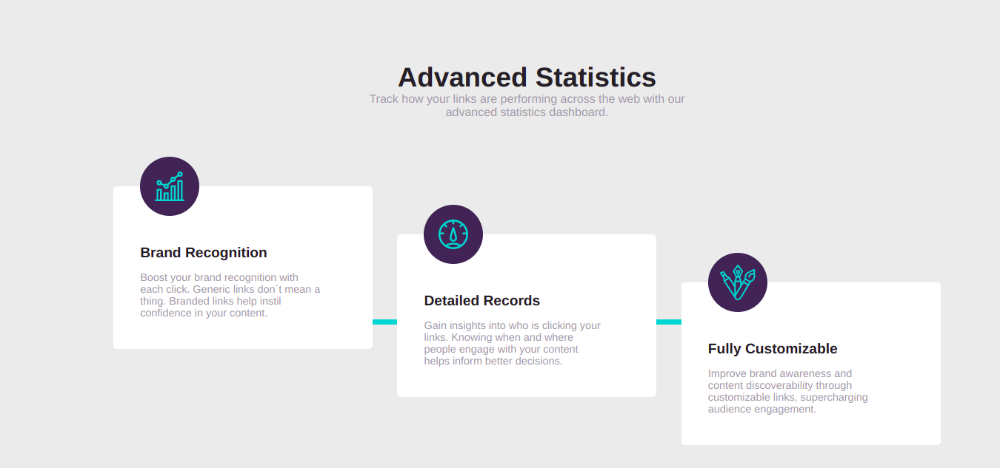
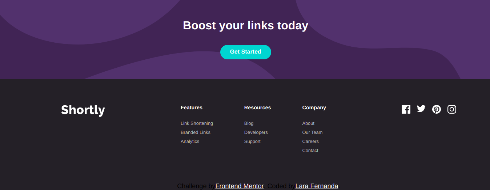

# URL Shortening API

<div>
    
    
    
    
</div>

# Tecnologias

<ul>
    <li>ReactJS</li>
    <li>Pré-processador Sass</li>
    <li>JavaScript</li>
</ul>

# Como executar

Clone o projeto em seu dispositivo e acesse a pasta do mesmo.

```
$ git clone https://github.com/Lara123-pg/URLShorteningAPI-FrontendMentor.git
$ cd URLShorteningAPI-FrontendMentor
$ code .  (Abrir o Visual Studio Code)
```

Logo em seguida, o projeto estará em seu editor para ser executado.

# Projeto

URL Shortening API é um desafio da plataforma FrontendMentor, que tem o objetivo de treinar os conceitos Frontend. E para que essa página fosse desenvolvida, foi utilizado ReactJS juntamente com o JavaScript, o Sass(Pré-processador CSS) e para fazer a funcionalidade do encurtador de link foi utilizado o site https://www.rebrandly.com/.

# Link do projeto hospedado

https://urlshorteningapi-frontendmentor.surge.sh/

# Autor

Lara Fernanda

Email: lamorimalvescavalcante@gmail.com

# Licença

Este projeto está sob a licença MIT - https://github.com/Lara123-pg/URLShorteningAPI-FrontendMentor/blob/main/LICENSE
